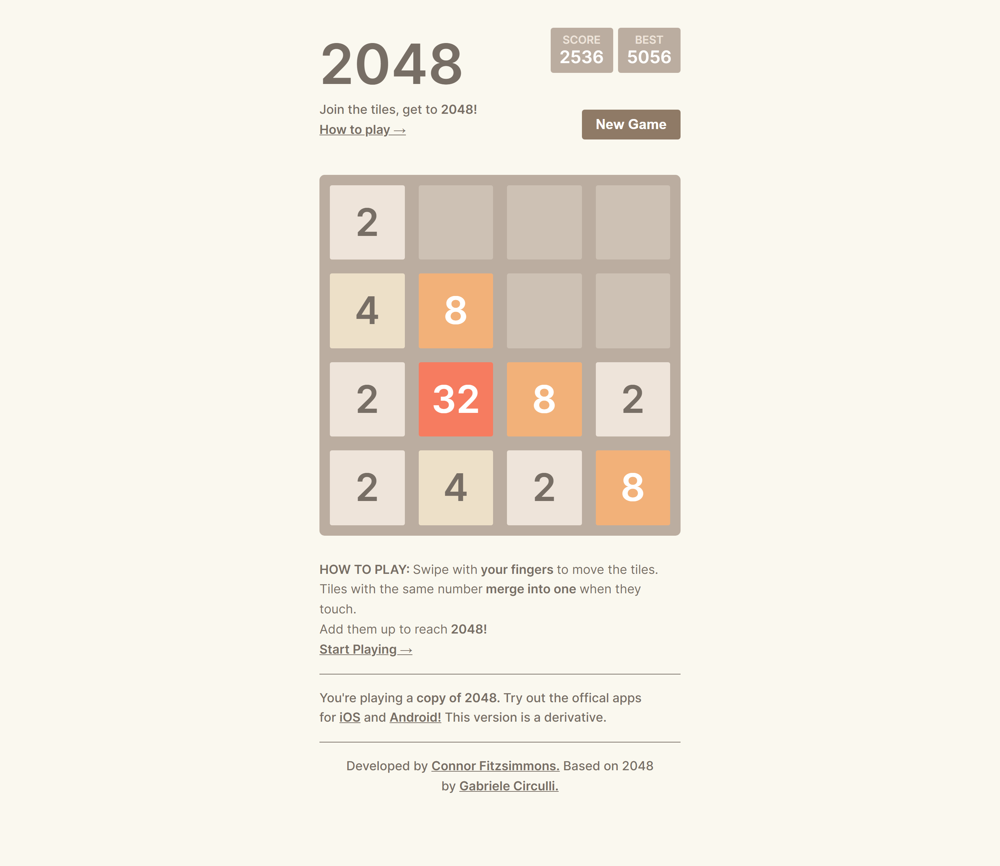
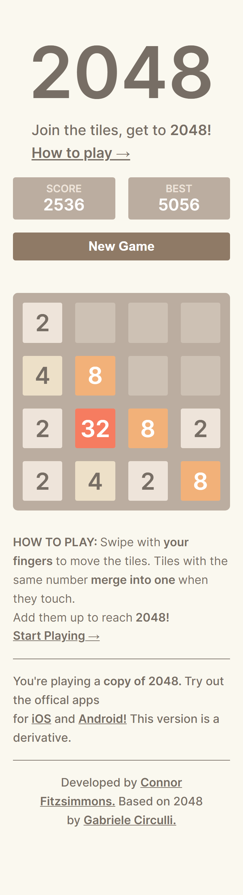

# 2048 Clone

## Link

http://connor-kfitz.github.io/2048-clone

## Description

The goal of this project was to create a copy of the popular game 2048 for web and mobile.

## Development

### Stage 1: Game Function

The first step in developing this application was getting the game state to function. I created a 2d nested array to represent the board, and connected the state to some HTML elements. Using the useEffect hook, I initialized  the keyboard events for the arrow keys.

To implement the block updates with each keypress, I decided to break up the movements into two parts. Focusing on left and right movements, I used logic to move the number blocks to the respective direction.  From here I merged the matching blocks together, and updated their value.

Once left and right movements were done, up and down was very simple to add.  I used the exact same functionality, but rotated the matrix before and after to mimic the change in direction.

### Stage 2: Web Design & Styling

Now that the game was working as intended, I elected to style it to match the original.  I changed some of the footer information to match myself, and acredit the original developer.  

### Stage 3: Animations

Animations proved to be the most difficult part of developing this app. First were the transition animation and merge animations, as the game did not feel complete without them. Breaking the game function up into translation and merge data made separating the two much easier. I decided to add two more states to the game, representing this data. The translation data array would contain information on which blocks to move, and the amount of blocks to move by, while the merge data simply displayed which blocks to merge. Lastly, another matrix was used to represent new tile animation data. This was done very similarily to the merge data, using different scale values.

### Stage 4: Responsiveness & Touch Events

Now that the game was complete, I wanted to make the app responsive. I diverted from how the original app responded to screen resize as I found it too basic. Touch events for mobile were added at the end, as this is originally a mobile app.

## Outcomes

Lots of challenges are learning from the four stages above. The first big issue I ran into was with state immutability, as before this project I was not familiar with the concept. I was very confused as to why my matrices were being transformed when running them through functions, without explicitly returning anything. Learning how to make deep copies overcame these issues, as I was able to store my matrices at various states.

Another large challenge I encountered was with transitions. Making them was not too difficult, but implementing them using the useEffect hook was challenging.  I opted to just use timeouts to manage things, but feel I should revisit this project and incorporate useEffect better.

Overall, this project was a success as I learned a lot that can be applied going forward. Probably going to take a break from making games for a bit, but will definitely make another in the future.

## Pictures

### Desktop

### Mobile
